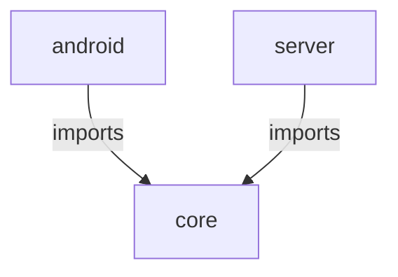

# Dicerealm
[](https://app.koyeb.com/deploy?name=dicerealm&repository=ryanntannn%2Fdicerealm&branch=main&builder=dockerfile&regions=sin&env%5BOPENAI_API_KEY%5D=%7B%7B+secret.OPENAI_API_KEY+%7D%7D&ports=8080%3Bhttp%3B%2F&hc_protocol%5B8080%5D=tcp&hc_grace_period%5B8080%5D=5&hc_interval%5B8080%5D=30&hc_restart_limit%5B8080%5D=3&hc_timeout%5B8080%5D=5&hc_path%5B8080%5D=%2F&hc_method%5B8080%5D=get)

Dicerealm is an AI powered multiplayer RPG experience, leveraging on cutting edge GenAI models to deliver an immersive and organic experience

This is the monorepo for the dicerealm project. It contains the following packages:

- [server](server/README.md) - The websocket server written in Java + Spring Boot
- [android](android/README.md) - The android application written in Java
- [web](web/README.md) - The web client application written in Vite + React + TS
- [core](core/README.md) - The shared core library written in Java

## App Overview



## Contributing

Please refer to the [CONTRIBUTING.md](CONTRIBUTING.md) file for information on how to contribute to this project.

## Deploying with docker

To build and run the static frontend and the server with docker, you can use the following commands:

```bash
docker build -t dicerealm/server .
```

To start the server, you can run the following command:

```bash
docker run -p 8080:8080 -e OPENAI_API_KEY=<your-api-key> dicerealm/server
```
