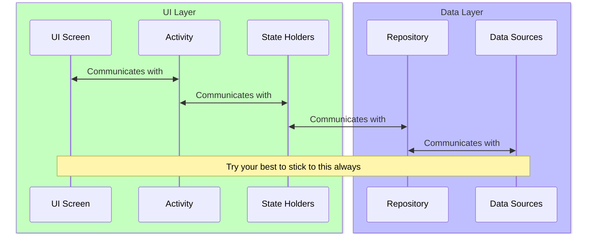
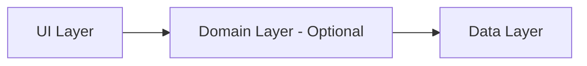
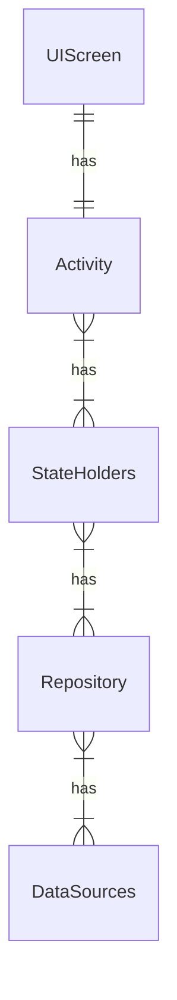

# Android Best Practices Architecture

## Overview
The architecture that we will be using in our android development is recommended by Android [Recommended App Architecture](https://developer.android.com/topic/architecture?gclid=CjwKCAjw6raYBhB7EiwABge5Klm_5PN8nJF0Jrb_ymrPP0JAEsbmemmGv_nsn0nBQKQtQMCBuvjehRoC7qcQAvD_BwE&gclsrc=aw.ds#recommended-app-arch). Allowing the seperation of purpose, ideal for medium to large scale projects. I didn't use Domain Layer in this project since its optional and I do not want to overcomplicate things.

## MVVM + Repository Architecture

-----
##### Flowchart

------
##### ER Diagram

----------

###### UI Screen
- The .layout file
- Display UI information to the user

###### Activity
- Tied to each screen
- Handles User interaction of the UI Screen to update views based on logic provided by State Holders

###### State Holders (View Modals, etc)
- Keep it generic with attributes & methods (only what user needs to see and use)
- Promotes reusability
- Interacts with the Activity & Repository
- Lifecycle aware and is tied to whichever Activity its scoped in

###### Repository
- Where the main underlying business logic resides
- 1 class per type of data (e.g. MovieRepo, ComicRepo)
- Is able to use multiple data sources

###### Data Sources
- 1 class per source of data (e.g. File, Network)
- Only accessible by repo
