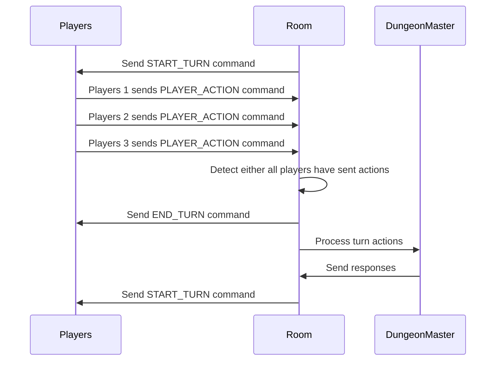

# Dialogue Turn Based System

## Overview

The dialogue turn-based system is a system that allows players to batch their actions and execute them in a turn-based manner. This system is used in games where players need to make decisions and interact with the game world through dialogue.

## Sequence Diagram

The following sequence diagram illustrates the flow of interactions between the player, the game server, and the game world in a dialogue turn-based system:

