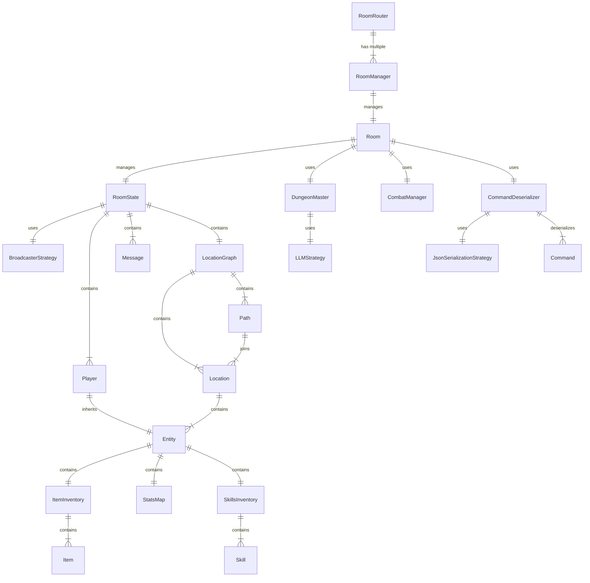

# Entity Relationship Diagram

The entity relationship diagram is a visual representation of the relationships between the entities in the game. The diagram is generated using the [Mermaid](https://mermaid-js.github.io/mermaid/#/) library.

The entity relationship diagram is different from the class diagram in that it focuses on the relationships between the entities rather than the attributes and methods of the entities. You may omit non-essential entities such as builders and helpers from the diagram to keep it simple and easy to understand.

Please update the diagram as the relationships between the entities change.

